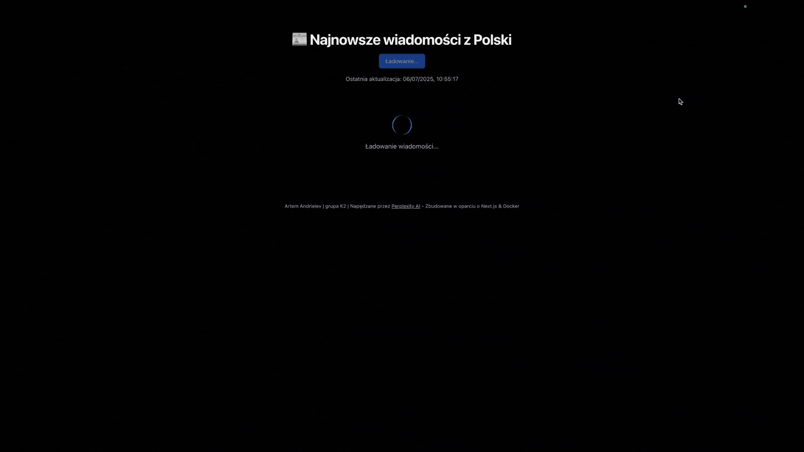

# my-nextjs-app

Aplikacja wykorzystuje model językowy (Perplexity LLM - sonar-pro) do generowania krótkich podsumowań 6 najnowszych wiadomości z Polski.

Działający link do aplikacji: https://my-nextjs-app-red.vercel.app/




## Spis treści
- [Funkcjonalności](#funkcjonalności)
- [Technologie](#technologie)
- [Instalacja](#instalacja)
- [Konfiguracja](#konfiguracja-klucza-api-perplexity)
- [Użycie](#użycie)
- [Dokumentacja](#dokumentacja)
- [Badge'e](#badgee)
- [Licencja](#licencja)
- [Autorzy](#autorzy)
- [Podziękowania](#podziękowania)

## Funkcjonalności
- Podsumowanie 6 najnowszych wiadomości z Polski przy użyciu Perplexity LLM

## Technologie
- Next.js
- SSR (Server-Side Rendering) i SSG (Static Site Generation)
- Wbudowane API Routes
- Tailwind CSS
- Konfiguracja Docker oraz CI/CD (GitHub Actions)

## Instalacja
```bash
# Klonowanie repozytorium
git clone https://github.com/USER/my-nextjs-app.git
cd my-nextjs-app

# Instalacja zależności
npm install
```

## Konfiguracja klucza API Perplexity
Utwórz plik `.env.local` w katalogu głównym projektu i dodaj:

```env
PERPLEXITY_API_KEY=twoj_pplx_klucz
```

Nie udostępniaj swojego klucza publicznie ani nie commituj go do repozytorium.

### Uruchomienie w trybie deweloperskim
```bash
npm run dev
```
Aplikacja będzie dostępna pod adresem <http://localhost:3000>.

### Budowanie wersji produkcyjnej
```bash
npm run build
npm start
```

## Użycie
Przykładowe wykorzystanie komponentu React w projekcie:
```tsx
import Button from '@/components/Button';

export default function Example() {
  return <Button>Kliknij mnie</Button>;
}
```

## Dokumentacja
Pełna dokumentacja Next.js znajduje się pod adresem <https://nextjs.org/docs>.

## Badge'e


## Licencja
Ten projekt jest objęty licencją MIT. Zobacz plik [LICENSE](LICENSE), aby poznać szczegóły.

## Autorzy
- Artem Andrieiev, grupa K2 – [@refatum-dev](https://github.com/refatum-dev)

## Podziękowania
- Podziękowania dla społeczności Next.js i Tailwind CSS

---

### Inne ważne pliki
- **LICENSE** – pełna treść licencji
- **CONTRIBUTING.md** – wytyczne dotyczące współtworzenia
- **CHANGELOG.md** – historia zmian
- **CODE_OF_CONDUCT.md** – zasady zachowania w projekcie
- **.github/ISSUE_TEMPLATE/** – szablony dla zgłaszanych problemów
- **.github/PULL_REQUEST_TEMPLATE.md** – szablon dla pull requestów
